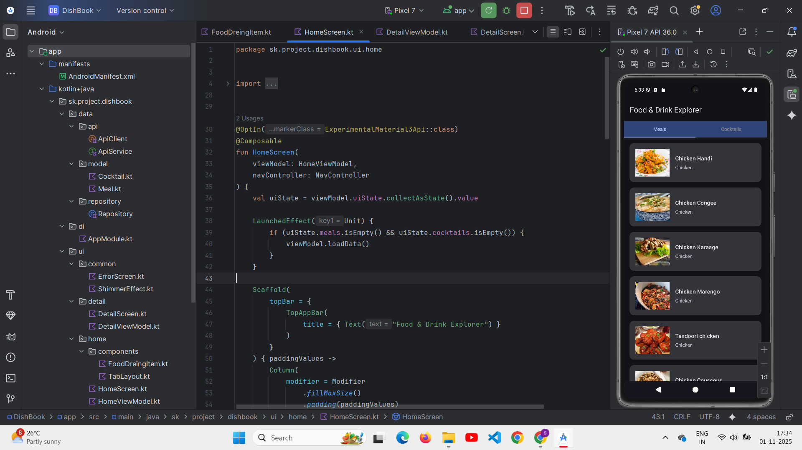
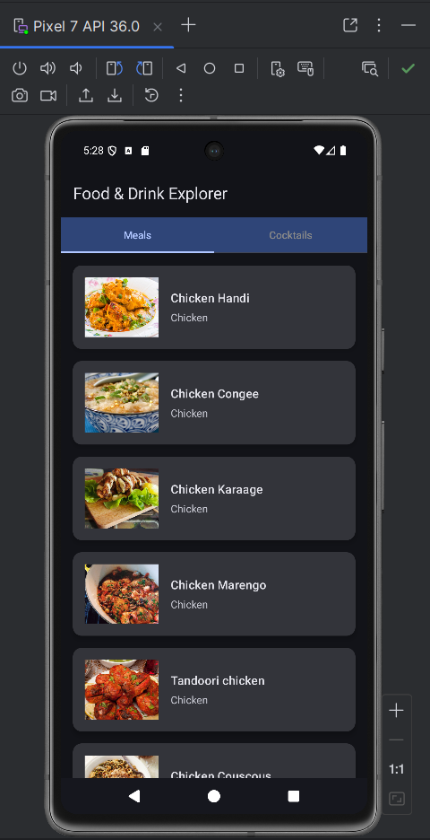
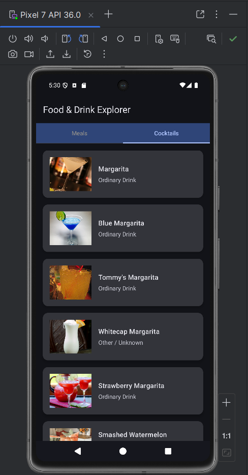
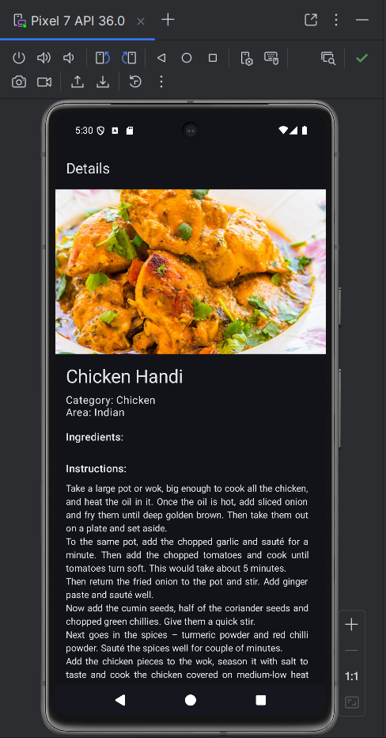
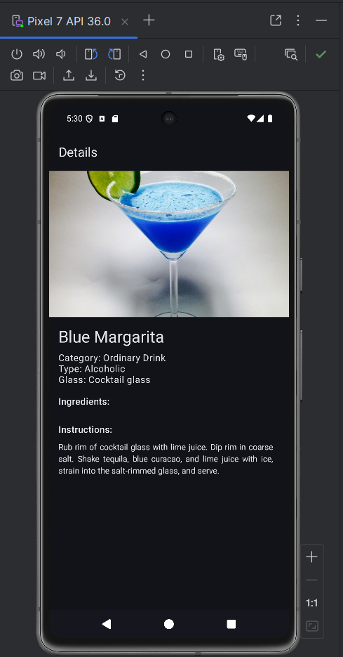
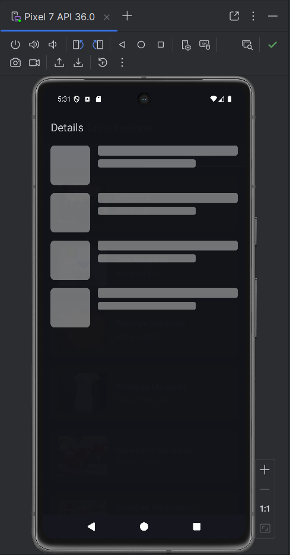

<h1 align="center">🍔🍸 DishBook - Foods and Drinks Explorer</h1>

  
  
  

---

## 📱 Project Overview

**DishBook** is a modern Android application built using **Jetpack Compose** and **MVVM architecture**.  
It allows users to explore a wide variety of **meals** and **cocktails** fetched from two public APIs — **TheMealDB** and **TheCocktailDB**.  
With a beautiful UI, smooth animations, and clean architecture, it provides a delightful food and drink discovery experience.

---

## 🔧 Features

<ul>
  <li>🍽️ Dual API Integration (TheMealDB + TheCocktailDB)</li>
  <li>🎨 Built with Jetpack Compose & Material Design 3</li>
  <li>⚡ Efficient data lists using LazyColumn</li>
  <li>✨ Smooth shimmer loading effects</li>
  <li>🚨 Robust error handling with retry functionality</li>
  <li>🧠 Clean MVVM architecture with Koin Dependency Injection</li>
  <li>🌊 Reactive data handling using Coroutines & Flow</li>
  <li>🖼️ Image loading with Coil</li>
  <li>🔀 Jetpack Navigation Compose for screen transitions</li>
</ul>

---

## 📸 Screenshots

### 🧩 Project Overview

  

  <em>
    Complete development environment showing Android Studio with project structure, source code implementation, 
    and the running emulator showcasing the app in action. This demonstrates the full development setup with 
    MVVM architecture and modern Android development practices.
  </em>

---

### 🍴 Meals & Cocktails | 📋 Detailed Views

  
  
  
  

  <em>
    First screenshot shows the list of meals loaded from MealsDB and Switch-tab is showing Meals-tab hightlighted.
    Second screenshot shows the list of cocktails lodded from CocktailsDB and Switch-tab is showing Cocktails-tab hightlighted.
    Third screenshot shows the details of the item selected from meals-list.
    Fourth sccreenshot shows the details of the item selected from cocktails-list.
  </em>

---

### ⏳ Loading Experience

  

  <em>
    Beautiful loading animation that provides visual feedback during data fetching from APIs. 
    The shimmer effect enhances user experience with smooth transitions and maintains engagement 
    while network operations are in progress.
  </em>

---

## 🧰 Tech Stack

- **Language:** Kotlin  
- **UI:** Jetpack Compose, Material Design 3  
- **Architecture:** MVVM  
- **Dependency Injection:** Koin  
- **Networking:** Retrofit, RxKotlin  
- **Asynchronous:** Coroutines, Flow  
- **Image Loading:** Coil  
- **Navigation:** Navigation Compose  

---

## 🚀 How to Run

1. **Open the project** in <strong>Android Studio</strong>. 
2. Ensure you have an active <strong>internet connection</strong> for API calls. 
3. Run the app on an <strong>emulator</strong> or <strong>physical device</strong> (minimum SDK 24+). 

---

## 🔗 API Integration

- 🍜 <a href="https://www.themealdb.com/api.php" target="_blank">TheMealDB API</a> 
- 🍸 <a href="https://www.thecocktaildb.com/api.php" target="_blank">TheCocktailDB API</a>

---

## 👨‍💻 Author

**Siddhant Kudale**  
<a href="https://github.com/siddhantkudale18" target="_blank">GitHub Profile</a>

---

Built with ❤️ using Modern Android Development

